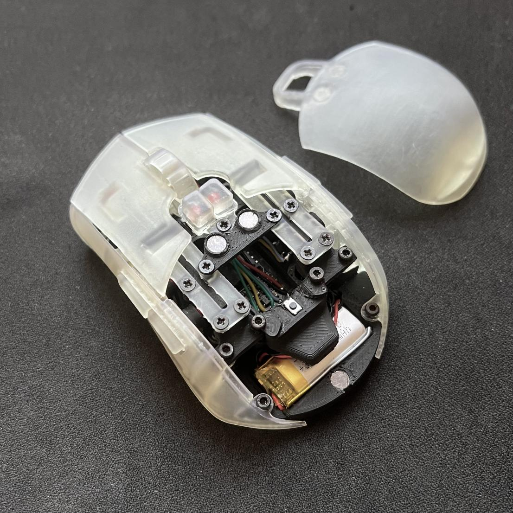
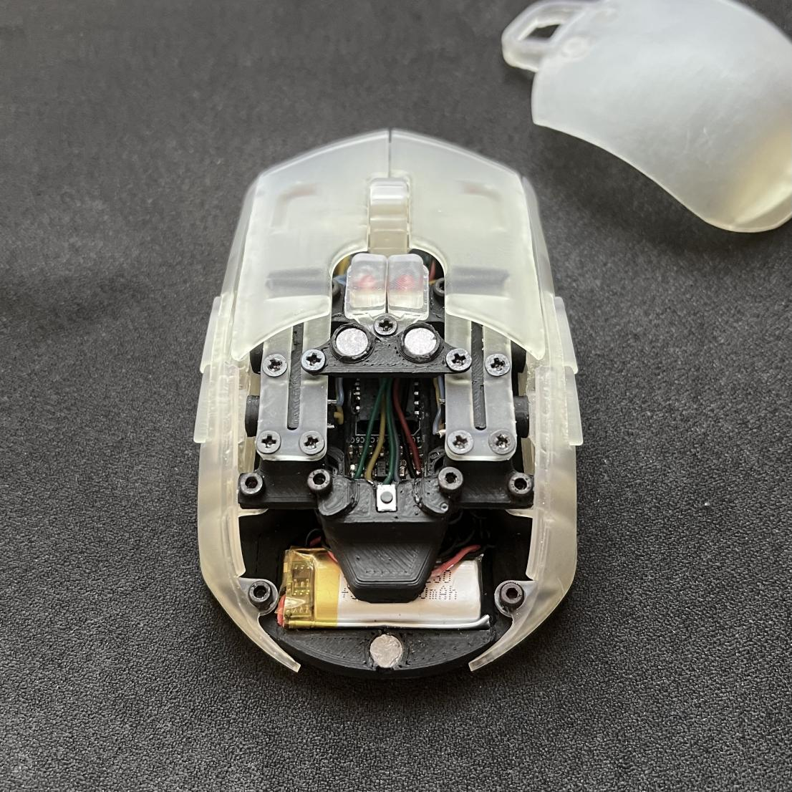
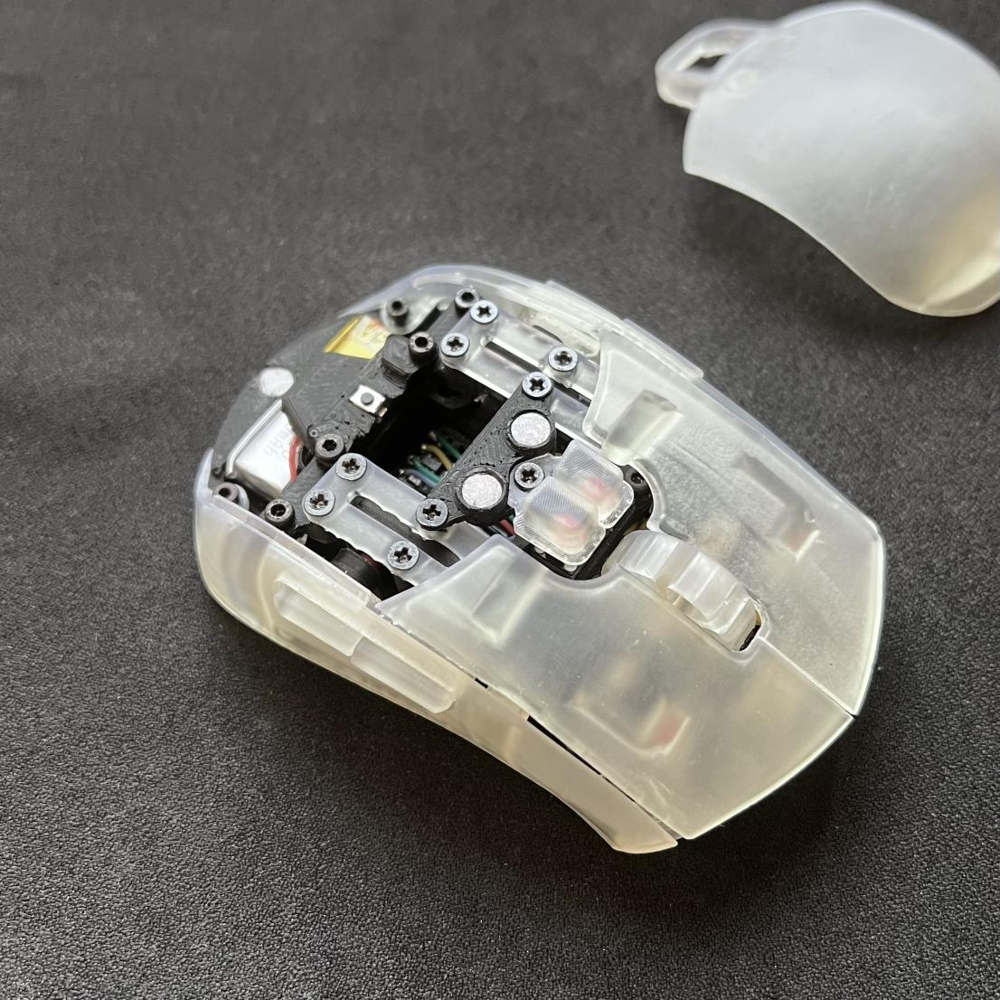
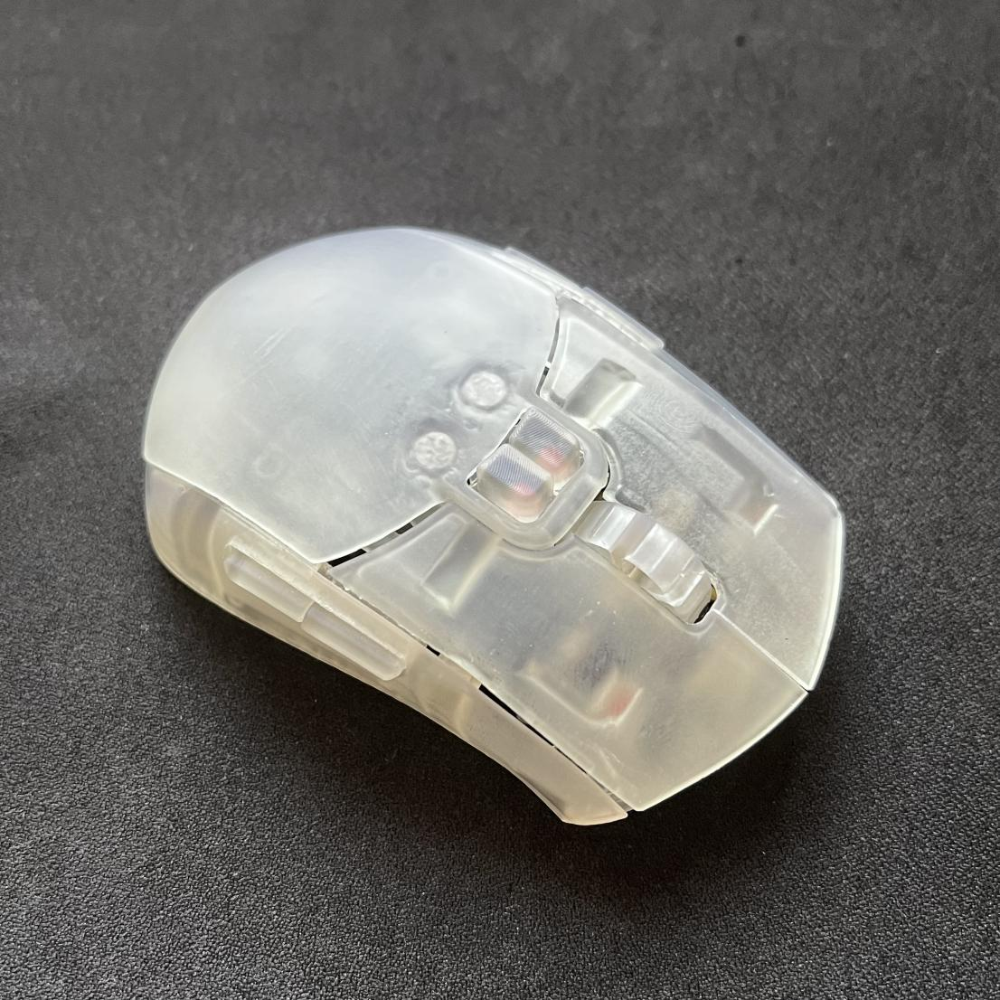
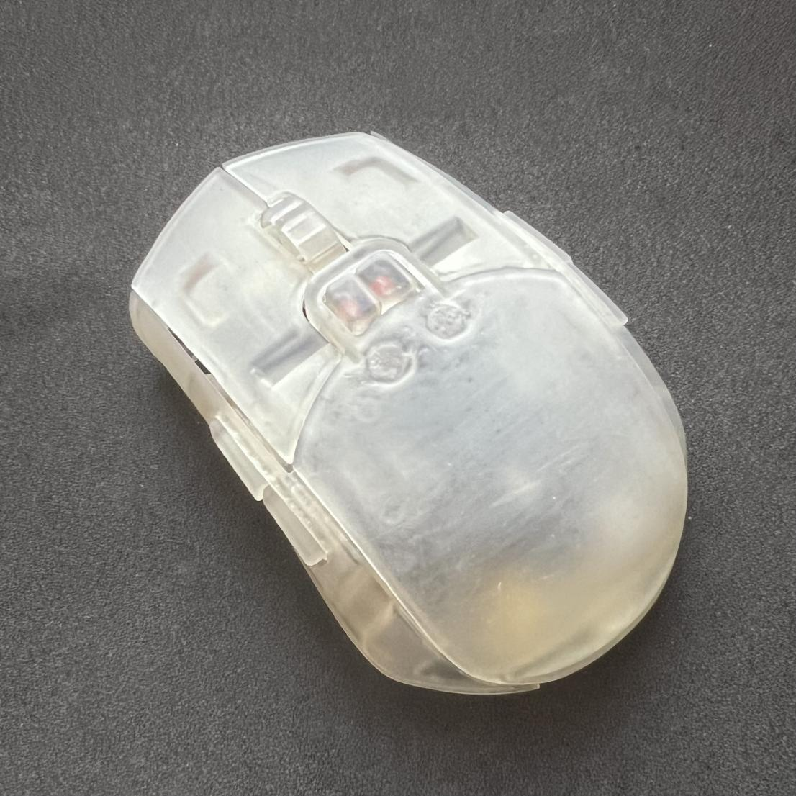
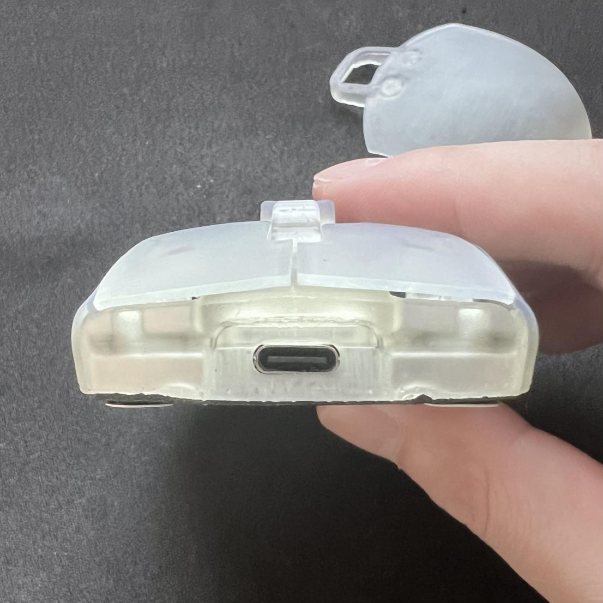
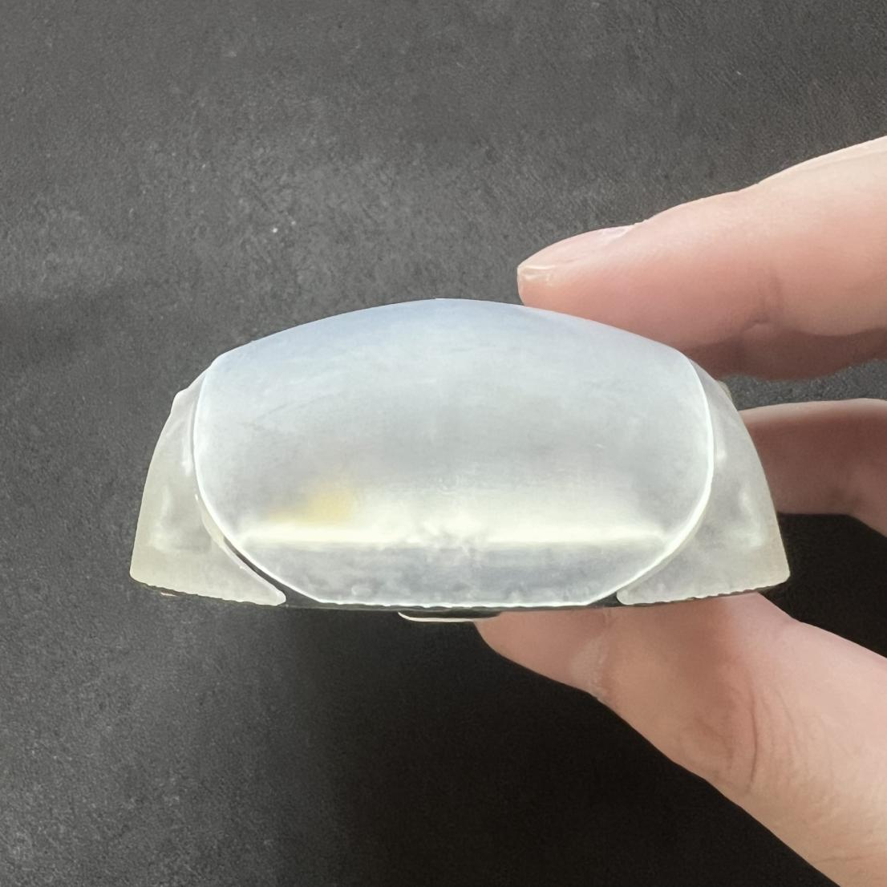

# moudabella

An open source bluetooth mouse 🐭 for CAD 🐱.

*Figure 1: PLA base / Resin shell

### Design Principles
- Symmetrical design
- 9 buttons
- Y2K Macintosh vibe
- No visible screws
- Not-too-bad middle click and scrolling
- Adjustable sensor position. With my slim breakout pcb. https://github.com/badjeff/pmw3610-pcb
- Powered by [ZMK](https://github.com/zmkfirmware/zmk) => OSS, on-devie profiling, say no to (Logxtxxh|Razxx) eco-system
- Optimized for fingertip grip and claw grip, swapable part for palm grip
- Easy facelifting. (and reprinting the yellowish parts)
- Ligthweight
- Medium to small size
- Rigid
- Long battery life
- Silent tactile switches
- Low Profile

### Gallery

[🎥 Sound Test](https://imgur.com/a/Uihee3r)

### BOM
|Unit|Item|
|-|-|
|1|Seeed Studio XIAO BLE (nRF52840)|
|1|PWM3610 Sensor [Breakout Board](https://github.com/badjeff/pmw3610-pcb)|
|9|Kailh CMI627301D07 6x6x7.3mm Silent Micro Switch|
|9|1N4148W T4 SOD-123 Diode|
|1|ALPS EC05-E1220401 (Vertical) Rotary Encoder|
|1|30x2mm Metal Shaft (File one end into a hexagonal shape, fit in EC05 Rotary Encoder)|
|1|MSK-1153 6 Pins Power Switch|
|1|3x4x2mm Tact Switch Turtle Switch|
|1|M2 Screw Boxset (3-10mm)|
|6|Neodymium Disc Magnets 5x1mm (Diameter x Thick)|
|1|601230 Lipo Battery (plus connector)|
|5|Thick Mouse Feet Skates Dots (~0.7mm)|
|1|28/26 AWG silicone wire|

### Building Guide / Tips

- Print base plate with PLA, easier to screw
- Use double-sided tap to secure the sensor breakout PCB while no futher position adjustment needed
- Lens-to-Surface distance must >2.4mm & <2.9mm. Mouse Feet must >0.65mm.
- Scroll wheel tube diameter is 2.2mm. Wrapping metal shaft with taps to fit, superglue one end if fitting done.

### Firmware

The ZMK firmware config repository can be find at [badjeff/moudabella-zmk-config](https://github.com/badjeff/moudabella-zmk-config).

## License

Available under the [CERN-OHL-P v2](/LICENSE) permissive license.
